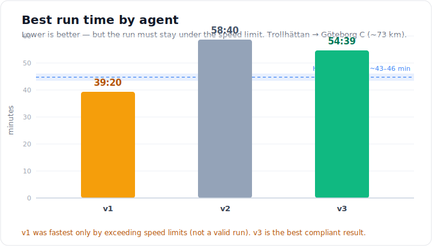
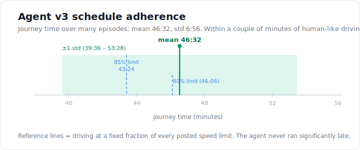
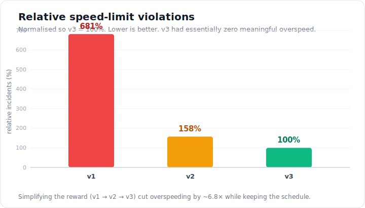

# Optimising Train Speed Profiles with Reinforcement Learning (SAC + Open Rails)

A reinforcement-learning agent that learns to drive a train in the open-source
[Open Rails](https://openrails.org/) simulator, optimising the *speed profile*
(speed vs. position) along the Trollhättan–Gothenburg line in Sweden for
punctuality and speed-limit compliance, using a hybrid approach that combines a
high-fidelity physics simulator with a Soft Actor-Critic (SAC) agent.

This repository accompanies the KTH bachelor thesis *"Hybrid Modelling Approach
to Optimise the Train Speed Profile"* by **Joel Håkansson** and **Adrian
Nagorka** (Department of Mathematics, Optimisation). The full thesis is publicly
available in KTH DiVA: **[<!-- TODO: paste DiVA URL --> add DiVA link here]**.

> **Status:** research code from the thesis project. It runs against a live
> Open Rails instance on Windows and is shared as a portfolio reference, not a
> turn-key package.

## Problem

Optimising a train's speed profile — how fast it should travel at each point of
a route — is central to energy efficiency and punctuality, but hard to solve
well with hand-tuned physics models alone. We frame it as a sequential control
problem: at every step the agent sets throttle and brake to make good progress
while staying under the current speed limit and stopping correctly at the
destination. The goal is a hybrid model that keeps the realism of a physics
simulator while letting an RL agent learn the driving policy.

## Approach

- **Simulator:** [Open Rails](https://openrails.org/), driven over its local
  HTTP cab-controls API (`/API/CABCONTROLS`). The Open Rails source was lightly
  modified to send throttle/brake commands and read back physical state each
  tick. Each worker runs its own simulator instance on its own port
  (`BASE_PORT + worker_index`).
- **Algorithm:** Soft Actor-Critic (SAC) via [Ray RLlib](https://docs.ray.io/en/latest/rllib/)
  and Ray Tune, PyTorch backend. SAC was chosen for its stability, sample
  efficiency (off-policy replay), and entropy-driven exploration in continuous
  action spaces.
- **Environment (`OpenRailsEnv.py`):** a `gymnasium.Env` wrapper.
  - **Action space:** continuous 2-D — `[throttle, brake]`, each in `[0, 1]`.
    The effective brake is capped (50%, later 33% of full service brake) to
    discourage harsh, inefficient braking.
  - **Observation space:** 13 numeric features — time, throttle, motive/brake
    force, speed, speed limit, acceleration, distance, gradient, distance to
    next station, brake value, next speed limit, and distance to the next
    speed-limit change. In later versions these are normalised to ≈[0, 1].
  - **Data pipeline:** Open Rails dumps physical state to a
    `PhysicalInfoDump<port>.csv` log; the environment tails the latest line,
    parses the (Swedish-formatted) numbers, normalises/feature-engineers them,
    and tracks upcoming speed-limit changes from precomputed milestone queues.
  - **Reward:** rewards distance covered (weighted by speed, only when not
    speeding) and stopping correctly at the station; penalises exceeding the
    speed limit (penalty grows with the square of the overshoot), braking far
    from a station, and missing a station.
- **Route:** Trollhättan → Gothenburg (Göteborg C), ≈73 km, SJ X2000 electric
  passenger train, timetable ≈40–50 min.

### Agent iterations

The reward and configuration were refined across three agents trained from
scratch:

| | v1 | v2 | v3 |
| --- | --- | --- | --- |
| Reward aims | punctuality, speed limit, jerk, energy | punctuality + speed limit | punctuality + speed limit |
| Normalised observations | no | yes | yes |
| Distance-to-next-speed-limit input | no | yes | yes |
| Max brake | 50% | 50% | 33% |
| Network (hidden) | 256×2 | 256×2 | 512×3 |
| Discount γ | 0.99 | 0.99 | 0.995 |

The key lesson: starting with too many competing reward terms (v1) produced an
over-conservative, high-variance policy; simplifying the objective (v2, v3) gave
a much cleaner learning signal.

## Results

Human baseline (no recorded driver data): driving at 80–85% of posted speed
limits implies ≈**43:24** (85%) to **46:06** (80%); two sample human runs took
51:29 and 46:29.

**Best single runs (speed-limit compliant unless noted):**

| Agent | Best time | Notes |
| --- | --- | --- |
| v1 | 39:20 | Fastest, but **frequently exceeded speed limits** — not acceptable |
| v2 | 58:40 | Obeys limits but extremely cautious; near dead-stops |
| v3 | 54:39 | Best balance — near-zero overspeed, decent progress |



**Schedule adherence (v3, over many episodes):** mean trip time **46:32**, std
**6:56** — within a couple of minutes of efficient human driving, and never
significantly late (no evaluated run exceeded ~50 min).



**Speed-limit violations (relative, v3 = 100% baseline):**

| | v1 | v2 | v3 |
| --- | --- | --- | --- |
| Relative overspeed incidents | 681.46% | 157.55% | 100% |



**Energy:** without an explicit energy term, the agents do not naturally
conserve energy — they tend to apply full throttle then brake. Energy
efficiency remains the clearest area for future improvement.

**Takeaway:** the hybrid approach reliably produces feasible, rule-abiding speed
profiles that meet safety and timing constraints. v3 gives the best
compliance/efficiency trade-off; a gap to the ~45-minute human baseline remains,
attributable mainly to the agent's reactive (rather than anticipatory) control.

_Charts above are regenerated from the values reported in the thesis._ See the
[thesis in KTH DiVA](#) for the full training curves and per-route speed-profile
figures.

## How to run

> Requires **Windows** and a working **Open Rails** installation, since the
> agent controls a live simulator.

**Prerequisites**

1. Install [Open Rails](https://openrails.org/) (the thesis used a slightly
   modified build exposing the cab-controls API) and the route/consist.
2. Confirm the HTTP API responds on
   `http://localhost:<port>/API/CABCONTROLS`.

**Setup**

```bash
pip install -r requirements.txt
cp config.example.py config.py   # then edit config.py for your machine
```

`config.py` (git-ignored) holds your local paths and ports:
`OPENRAILS_EXE`, `OR_LOG_DIR`, `RESULTS_DIR`, `BASE_PORT`, `TIME_SPEED`.

**Train**

```bash
python main.py
```

`auto.py` is an optional supervisor that restarts `main.py` periodically (Open
Rails can become unstable over long runs). `API_test.py` and `start_OR.py` are
helpers for poking the API and launching the simulator manually.

**Environment used in the thesis:** Python 3.9, Ray RLlib 2.x, Windows 10.
Training ran on single machines (Ryzen 7 5800X / RTX 4060, and i7-8700K /
GTX 1080 Ti); v1 trained intermittently over ~3 months, v2 ~1 month, v3 ~1–2
weeks. No GPU was needed given the small networks.

## Limitations

- **Windows-only and simulator-bound:** training needs a live Open Rails
  instance; no headless or offline mode.
- **Reactive, not anticipatory:** the agent slows down once it reaches a
  restriction rather than planning ahead, leaving a gap to the human baseline.
- **No energy optimisation in the final agent:** the energy term was dropped to
  simplify learning.
- **Single route / train:** speed-limit milestones and the destination are
  hard-coded to one scenario; generalisation is untested.
- **Brittle automation:** `start_OR.py` uses fixed screen coordinates tuned to a
  2560×1440 monitor.
- **Compute-limited:** long training runs and an unstable simulator constrained
  hyperparameter search; results are promising but preliminary.

## Citation

If you reference this work, please cite the thesis (see KTH DiVA). A
machine-readable `CITATION.cff` can be added on request.

## Authors

- Joel Håkansson
- Adrian Nagorka

Joint bachelor thesis, KTH Royal Institute of Technology. Supervisor: Yuhua Yao.

## License

Released under the [MIT License](LICENSE). Open Rails is a separate project under
its own license (GPL); this repository only communicates with it over HTTP and
does not include or modify Open Rails source code.
